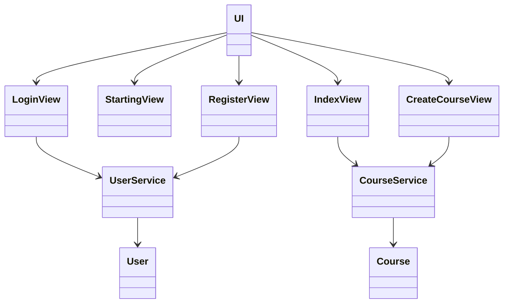
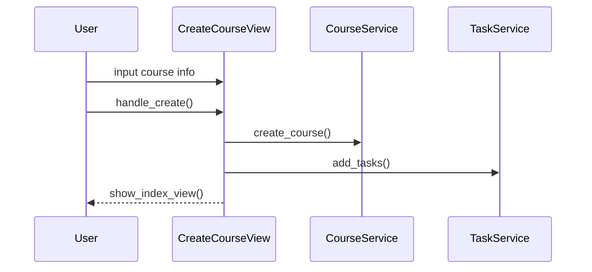

```mermaid
classDiagram
    UI --> RegisterView
    UI --> StartingView
    UI --> LoginView
    UI --> IndexView
    UI --> CreateCourseView
    LoginView --> UserService
    RegisterView --> UserService
    IndexView --> CourseService
    CreateCourseView --> CourseService
    UserService --> User
    CourseService --> Course
```

## Sekvenssikaavio:

```mermaid
sequenceDiagram

User->>CreateCourseView: input course info
User->>CreateCourseView: handle_create()
CreateCourseView->>CourseService: create_course()
CreateCourseView->>TaskService: add_tasks()
CreateCourseView-->>User: show_index_view()

```