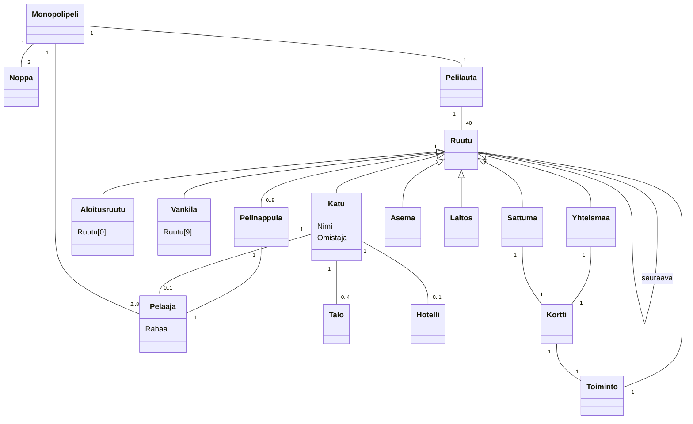

## Monopoli

```mermaid
 classDiagram
    Monopolipeli "1" -- "2" Noppa
    Monopolipeli "1" -- "1" Pelilauta
    Pelilauta "1" -- "40" Ruutu
    Ruutu "1" -- "1" Ruutu : seuraava
    Ruutu "1" -- "0..8" Pelinappula
    Pelinappula "1" -- "1" Pelaaja
    Pelaaja "2..8" -- "1" Monopolipeli

    Ruutu <| -- Aloitusruutu
    Ruutu <| -- Vankila
    Ruutu <| -- Sattuma
    Ruutu <| -- Yhteismaa
    Ruutu <| -- Asema
    Ruutu <| -- Laitos
    Ruutu <| -- Katu
    class Vankila {
        Ruutu[9]
    }
    class Aloitusruutu {
        Ruutu[0]
    }
    Katu "1" -- "0..4" Talo
    Katu "1" -- "0..1" Hotelli
    class Katu {
        Nimi
        Omistaja
    }
    class Pelaaja {
        Rahaa
    }
    Ruutu "1" -- "1" Toiminto
    Yhteismaa "1" -- "1" Kortti
    Sattuma "1" -- "1" Kortti
    Kortti "1" -- "1" Toiminto
    Katu "1" -- "0..1" Pelaaja
```
